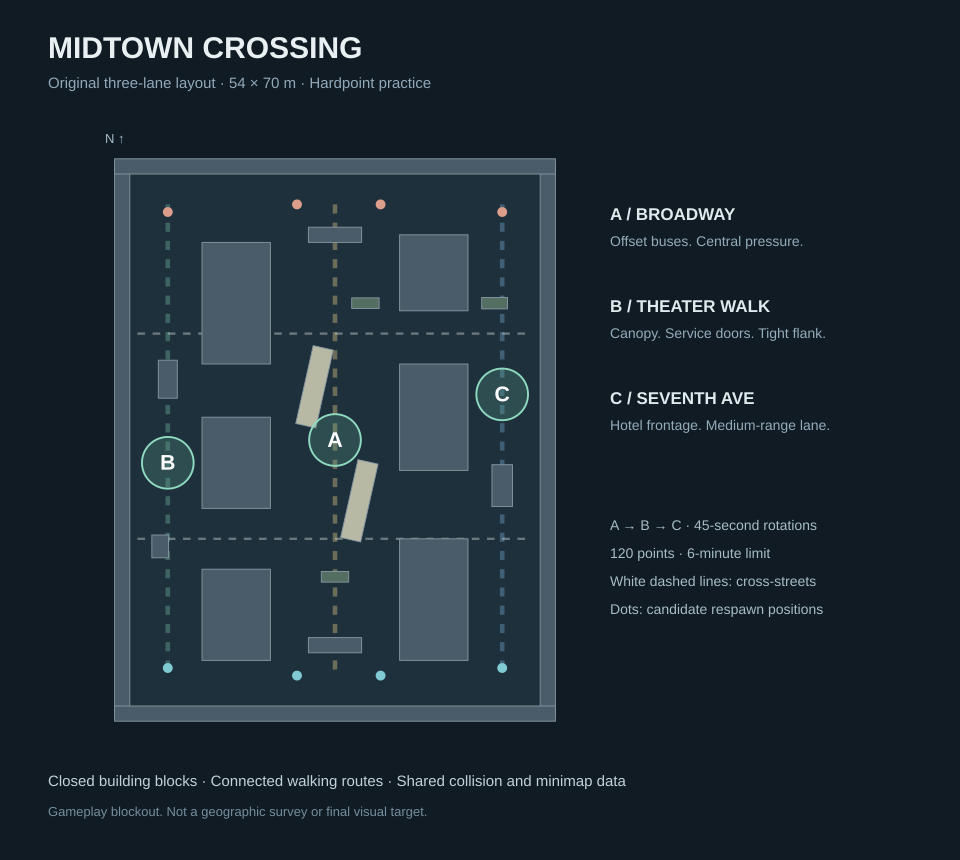

# Midtown Crossing: TDM and fidelity pass

Branch: `v3/midtown-tdm-fidelity`.

Historical notes for the previous branch. The active development pass is documented in [MIDTOWN-FFA.md](MIDTOWN-FFA.md).

The direction is now simple local team deathmatch, with fidelity taking priority over new modes, progression or multiplayer. The previous hardpoint implementation is removed from this branch and remains recoverable in `v3/midtown-hardpoint` and Git history.

## Playable rules

- 3v3: the human player and two blue-marked robot allies against three red-marked robot opponents.
- First team to 40 eliminations wins. Eight-minute limit; tied scores draw.
- Player and bots respawn after three seconds. Spawn placement weighs exposure, distance and occupied positions.
- Friendly fire is off. Enemy locations are not exposed on the minimap.
- Bots patrol the three lanes, acquire opponents with clear sightlines, react, fire bursts and reload. Both teams fight independently of the player.
- There are no capture points, control rings, objective rotations, or points for occupying an area.
- Existing player movement, health, recoil, ADS, weapon definitions and first-person gun/hand animations are retained. Bot health and aim are separate practice-mode tuning.
- TDM does not post horde leaderboard scores or grant horde progression XP.
- `?mode=horde` still opens the original survival arena.

## Fidelity changes in this pass

- Individual storefront bays, door frames, handles, glazing layers, upper-storey window frames, mullions, sills and lintels.
- Cornices, pilasters, rooftop equipment, window AC units, theater canopy and fire escapes.
- Metre-scaled brick, stone, concrete, brushed-metal and asphalt shader materials. Procedural height modifies lighting normals; surface roughness varies independently of colour. These are authored shaders, not downloaded scanned assets.
- Beveled bus and service-prop geometry, vehicle panel joints, wipers, wheel hubs, roof ventilation and rear lights.
- Flush drainage grates, manhole covers, curb-edge detailing, street signs and collision-backed lamp posts.
- Soft contact-shadow accents and restrained local light pools at the theater and deli.
- Robot-held carbines with receivers, magazines, stocks, barrels, optics and brief muzzle flashes. Blue/red team accents, less glossy body materials and a simple reload arm pose.
- Position-based robot footsteps, reload cues and near-miss snaps, plus distinct pavement/asphalt player footstep synthesis. Existing player gunshot synthesis remains intact.

The supplied TTK clip remains the visual reference for human-scale detail, material separation, lighting contrast, weapon presentation and animation continuity. This pass is not a claim to exceed TTK. Superiority needs direct comparisons of recorded gameplay, sound and frame-time stability, not just a feature list or a successful build.

## What still needs the final-quality treatment

1. Asset-level detail: authored or scanned material sets, varied props, believable interiors, surface decals and non-repetitive background architecture.
2. Character animation: authored grip alignment, aim offsets, foot planting, directional locomotion, reloads and deaths. Current robot motion is procedural.
3. First-person presentation: compare every carried weapon against the reference for sight clarity, hand contact, recoil recovery and animation transitions without changing its simulation.
4. Sound: original or licensed recordings for guns, handling and footsteps; interior/exterior tails and a full mix review. Current added effects are synthesized, not a final sample library.
5. Rendering: GPU shader validation, contact-lighting review, shadows at each quality tier, texture budgets and measured frame times on the target desktop and mobile hardware.

Multiplayer is deliberately deferred. This code implements local bots, not online teams or server-authoritative networking.

## Local testing in Cursor

From your repo directory, with your existing edits committed or stashed if necessary:

```sh
git fetch origin
git switch --track origin/v3/midtown-tdm-fidelity
npm ci
npm run dev
```

If the local branch already exists, use `git switch v3/midtown-tdm-fidelity` and `git pull --ff-only` instead. Open the URL printed by Vite. Use `?nospawn` for visual inspection, `?god` for uninterrupted combat viewing, and `?mode=horde` to compare the original arena.



For this pass, review fidelity first: close-up street surfaces, storefront depth, bus silhouettes, weapon readability, robot team identification, animation and sound. Layout changes are not a prerequisite for continuing the art work.

## Validation

All 141 automated tests pass. The suite covers TDM rosters, scoring, friendly fire, death/respawn, match limits, patrol connectivity, deterministic restarts, preserved weapon definitions, merged geometry and team-colored robot poses. The production build passes. Scene construction is also checked with a native canvas backend for finite vertex data and transforms.

These checks do not replace a GPU/browser playtest. The cloud preview browser previously refused the local server with `ERR_BLOCKED_BY_CLIENT`. Live shader rendering, HUD layout, sound quality and frame rate remain unverified here. Inspect this branch locally before merging it to main.

No external texture assets were installed. Poly Haven's official [asset license](https://polyhaven.com/license) and [brick](https://polyhaven.com/a/brick_wall_02)/[asphalt](https://polyhaven.com/a/asphalt_02) sources were researched, but acquisition was unavailable in this environment. No missing remote texture downloads are required for this branch to run.
